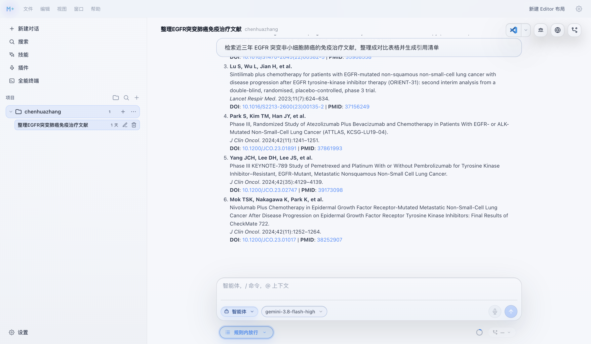
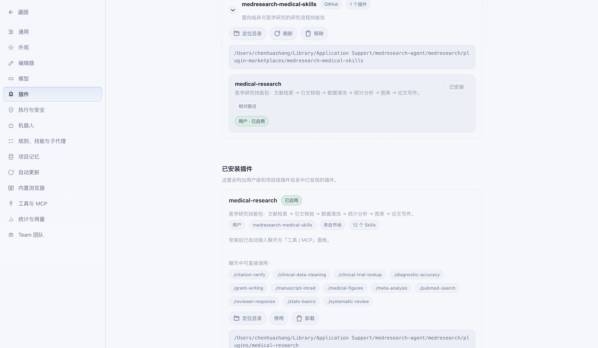
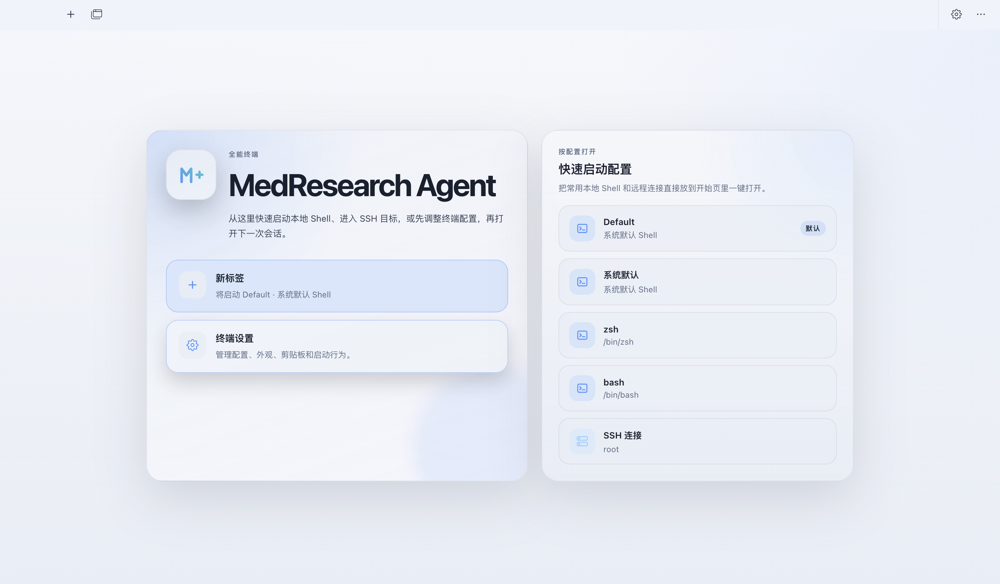
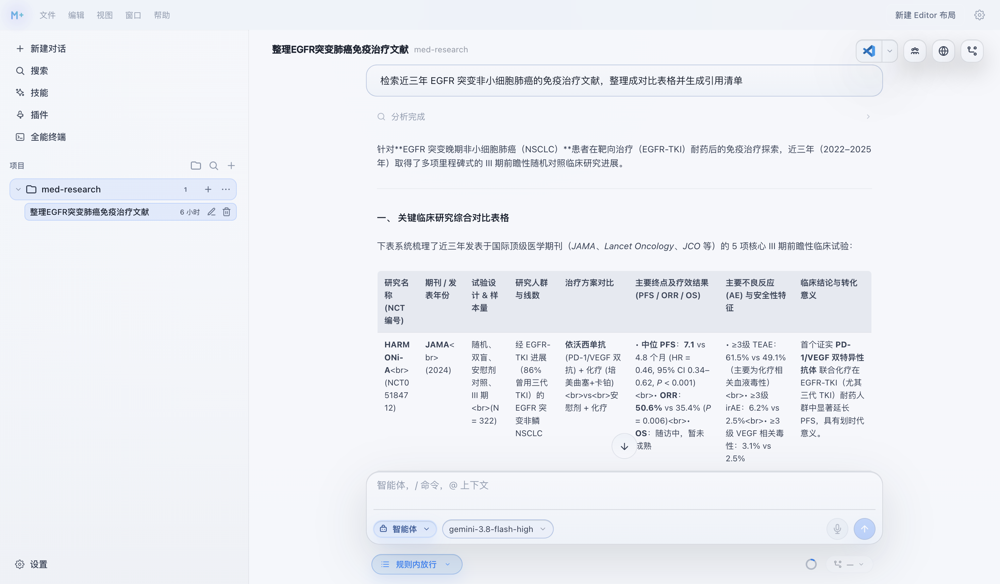
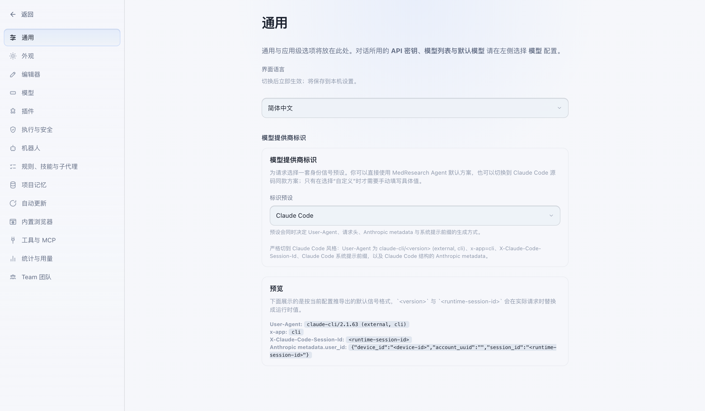
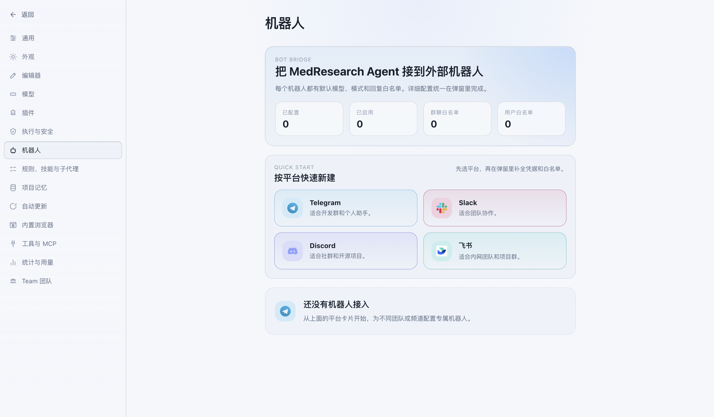

# MedResearch Agent

**An open-source desktop research workbench for clinical and medical research — Agent, editor, Git and terminal in one workspace.**

MedResearch Agent is not "an editor with a chat sidebar bolted on". It puts the Agent, the editor, Git, the terminal, plan review, model configuration and tool execution into **one desktop workspace** — and it is local-first: your threads, settings, plans and workspace state stay on your machine.

> 中文文档：[README.zh-CN.md](./README.zh-CN.md)

- Version: `0.0.45`
- Website: [cyrus818.github.io/MedResearch-Agent](https://cyrus818.github.io/MedResearch-Agent/)
- Download: [macOS builds (dmg / zip)](https://github.com/imchenhua/MedResearch-Agent/releases/latest)
- License: [Apache-2.0](./LICENSE)
- Stack: Electron 41 · React 19 · Vite 6 · TypeScript 5.9 · Vitest 3
- Tests: **711 passing** across 118 files

---

## Highlights

### Agent & conversation

- **Four Composer modes** — `Agent`, `Plan`, `Ask`, `Debug`.
- Agent mode runs a **multi-turn tool loop** with streaming tool arguments, approval gates and error recovery.
- **Team mode** orchestrates a Team Lead with specialist / reviewer roles.
- **Nested and background sub-agents** for delegating long-running work.
- Agent file changes are reviewable: per-hunk accept / revert, file snapshots, and diff previews next to the conversation.

### Editing & workspace

- **Monaco** editor with quick open, file tree, and Markdown preview.
- **xterm.js** terminal that is a first-class citizen, not a drawer afterthought.
- Workspace **file search**, **symbol index**, and an embedded **TypeScript language service** (definition jump + diagnostics).
- Built-in **SSH / SFTP** terminal with saved profiles and a secrets cache.

### Git

- Status, diff previews, stage, commit, push, upstream setup, branch list / checkout / create — all inside the app.

### Platform & integrations

- **Browser sidebar** plus browser automation tools, and a request-capture pipeline (proxy CA install, MITM capture, request analysis, session save/load).
- **MCP servers** — configure and call tools over the Model Context Protocol.
- **Bot platforms** — Slack, Discord, Telegram, Feishu (飞书).
- **BYOK model access** — OpenAI-compatible, Anthropic and Gemini providers, including OAuth / Codex login flows.
- Auto-update, usage statistics, theming and layout persistence.

---

## Screenshots

| Literature search | Skill marketplace | Terminal |
| --- | --- | --- |
|  |  |  |

| Multi-agent | Settings | Bots |
| --- | --- | --- |
|  |  |  |

> Screenshots live in [`docs/assets/`](./docs/assets).

---

## Quick start

### Requirements

- Node.js **20 or newer** (developed and tested on Node 22)
- npm

### Install and run

```bash
git clone https://github.com/imchenhua/MedResearch-Agent.git
cd MedResearch-Agent
npm install
npm run dev
```

`npm run dev` builds the main-process bundle, starts Vite on port 5173, and launches Electron.

### Scripts

| Command | What it does |
| --- | --- |
| `npm run dev` | Dev server + Electron (hot reload for the main process bundle) |
| `npm run dev:debug` | Same, with DevTools forced open |
| `npm test` | Run the Vitest suite (`npm run test:watch` for watch mode) |
| `npm run typecheck` | `tsc --noEmit` |
| `npm run build` | Full production build (main bundle + renderer) |
| `npm run desktop` | Build and run against `dist/` instead of the dev server |
| `npm run release:mac` | Package a macOS dmg + zip |
| `npm run release:win` | Package a Windows NSIS + MSI installer |

---

## Project layout

```
main-src/        Main process — the behaviour layer.
                 Agent, LLM providers, IPC handlers, storage (SQLite),
                 file/symbol index, MCP, shell, bots, browser, terminal.
src/             Renderer — React UI, composed largely through hooks.
electron/        Electron entry (main.cjs) and the preload bridge.
llm-wiki/   Curated knowledge base for humans and agents.
docs/assets/     Screenshots and brand assets.
scripts/         Build, icon export, and maintenance scripts.
```

### The `main-src/` vs `src/` split matters

This is an **AI Shell**, not a thin UI over a hosted API — a large amount of behaviour lives in the main process. If you are looking for "why did the app do X", the answer is frequently in `main-src/`, not in a React component.

### The IPC boundary

The renderer reaches the main process through `window.medresearchShell.invoke(channel, ...)`. Only channels listed in `INVOKE_CHANNELS` inside [`electron/preload.cjs`](./electron/preload.cjs) are allowed; everything else is rejected.

There are **225** registered `ipcMain.handle` channels, and the whitelist is kept exactly in sync with them by [`main-src/ipc/ipcChannelContract.test.ts`](./main-src/ipc/ipcChannelContract.test.ts), which fails the build if a channel is registered without being whitelisted — or whitelisted without a handler.

A domain-by-domain index lives in [`llm-wiki/architecture/ipc-channel-map.md`](./llm-wiki/architecture/ipc-channel-map.md).

---

## Where data lives

- Threads, agent sessions, and settings are stored locally (SQLite via `better-sqlite3`).
- Plans are written to `<workspace>/.medresearch/plans/`, falling back to `userData/.medresearch/plans/` when no workspace is open; a structured copy is also kept alongside the thread.
- Workspace indexes and caches are generated under `.medresearch/` and are safe to delete.

---

## Documentation

[`llm-wiki/`](./llm-wiki) is a curated, reviewable knowledge layer that sits above the runtime memory:

- [Project overview](./llm-wiki/project-overview.md)
- [Repository map](./llm-wiki/repo-map.md)
- [Runtime architecture](./llm-wiki/architecture/runtime-architecture.md)
- [Agent system](./llm-wiki/architecture/agent-system.md)
- [IPC channel map](./llm-wiki/architecture/ipc-channel-map.md)
- [Contradictions and open questions](./llm-wiki/meta/contradictions-and-open-questions.md)

---

## License

[Apache-2.0](./LICENSE)
