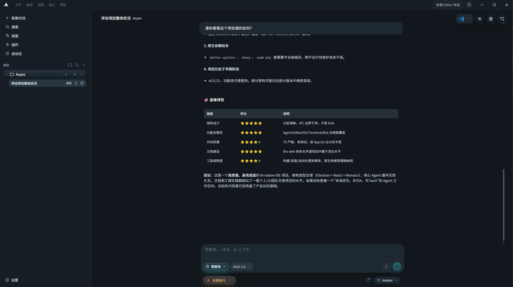
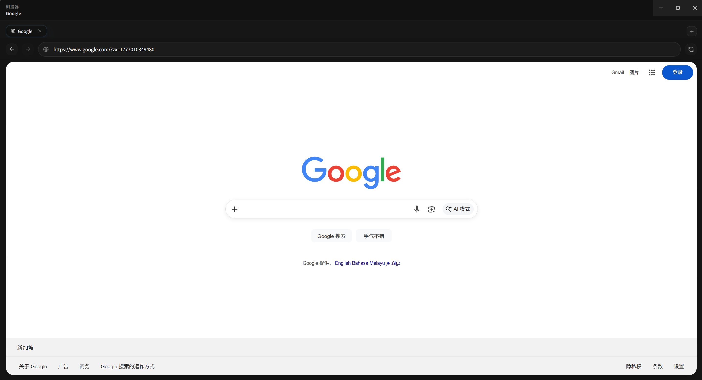

# MedResearch Agent

**面向临床与医学研究的开源桌面研究台 —— Agent、编辑器、Git、终端收进同一个工作区。**

MedResearch Agent 不是"给现有编辑器塞一个聊天侧栏"。它把 Agent、编辑器、Git、终端、计划审阅、模型配置和工具执行放进**同一个桌面工作区**；并且是本地优先的 —— 线程、设置、计划和工作区状态都留在你自己的机器上。

> English: [README.md](./README.md)

- 版本：`0.0.45`
- 官网：[cyrus818.github.io/MedResearch-Agent](https://cyrus818.github.io/MedResearch-Agent/)
- 下载：[macOS 安装包（dmg / zip）](https://github.com/imchenhua/MedResearch-Agent/releases/latest)
- 许可证：[Apache-2.0](./LICENSE)
- 技术栈：Electron 41 · React 19 · Vite 6 · TypeScript 5.9 · Vitest 3
- 测试：**711 个通过**，覆盖 118 个测试文件

---

## 能力一览

### Agent 与对话

- **四种 Composer 模式** —— `Agent`、`Plan`、`Ask`、`Debug`。
- Agent 模式是**多轮工具循环**：工具参数流式展示、审批闸门、错误恢复。
- **Team 模式**：Team Lead + specialist / reviewer 角色编排。
- 支持**嵌套子 Agent** 和**后台子 Agent**，把长任务委派出去。
- Agent 改动可审阅：按 hunk 接受 / 回滚、文件快照、diff 预览直接摆在对话旁边。

### 编辑与工作区

- **Monaco** 编辑器，配快速打开、文件树、Markdown 预览。
- **xterm.js** 内嵌终端，它不是"抽屉里的附属品"，而是一等公民。
- 工作区**文件搜索**、**符号索引**，以及内嵌的 **TypeScript 语言服务**（定义跳转 + 诊断）。
- 内置 **SSH / SFTP** 终端，支持 profile 保存与密码缓存。

### Git

- 状态、diff 预览、暂存、提交、推送、设置上游、分支列表 / 切换 / 新建 —— 全在应用内完成。

### 平台与集成

- **浏览器侧栏** + 浏览器自动化工具，以及请求捕获链路（代理 CA 安装、MITM 抓包、请求分析、会话存取）。
- **MCP 服务器**：通过 Model Context Protocol 配置并调用工具。
- **Bot 平台**：Slack、Discord、Telegram、飞书。
- **BYOK 接入模型**：OpenAI-compatible、Anthropic、Gemini，含 OAuth / Codex 登录流程。
- 自动更新、使用统计、主题与布局持久化。

---

## 截图

| 多 Agent | 工作区 | 终端 |
| --- | --- | --- |
|  |  |  |

| 浏览器 | 设置 | Bot |
| --- | --- | --- |
|  |  |  |

> 截图存放在 [`docs/assets/`](./docs/assets)，可用 `npm run readme:screenshots` 重新导出。

---

## 快速开始

### 环境要求

- Node.js **20 及以上**（本项目在 Node 22 上开发与测试）
- npm

### 安装与运行

```bash
git clone https://github.com/imchenhua/MedResearch-Agent.git
cd MedResearch-Agent
npm install
npm run dev
```

`npm run dev` 会构建主进程产物、在 5173 端口启动 Vite，然后拉起 Electron。

### 常用命令

| 命令 | 作用 |
| --- | --- |
| `npm run dev` | 开发服务器 + Electron（主进程产物热更新） |
| `npm run dev:debug` | 同上，并强制打开 DevTools |
| `npm test` | 跑 Vitest 全量测试（`npm run test:watch` 为监听模式） |
| `npm run typecheck` | `tsc --noEmit` |
| `npm run build` | 完整生产构建（主进程 + 渲染层） |
| `npm run desktop` | 构建后直接跑 `dist/`，不走开发服务器 |
| `npm run release:mac` | 打 macOS dmg + zip 包 |
| `npm run release:win` | 打 Windows NSIS + MSI 安装包 |

---

## 项目结构

```
main-src/        主进程 —— 行为层。
                 Agent、LLM 供应商、IPC handlers、存储（SQLite）、
                 文件/符号索引、MCP、shell、bot、browser、终端。
src/             渲染层 —— React UI，大量复杂状态通过 hooks 组织。
electron/        Electron 入口（main.cjs）与 preload 桥。
llm-wiki/   给人和 Agent 看的、可审阅的知识层。
docs/assets/     截图与品牌素材。
scripts/         构建、图标导出与维护脚本。
```

### `main-src/` 与 `src/` 的分工很关键

这是一个 **AI Shell**，不是套在托管 API 上的薄 UI —— 大量行为住在主进程里。当你想问"这个行为到底是谁做的"，答案经常在 `main-src/`，而不是某个 React 组件里。

### IPC 边界

渲染层通过 `window.medresearchShell.invoke(channel, ...)` 访问主进程。只有列在 [`electron/preload.cjs`](./electron/preload.cjs) 的 `INVOKE_CHANNELS` 里的通道才会被放行，其余一律拒绝。

主进程共注册 **225** 个 `ipcMain.handle` 通道，白名单与它们严格一致 —— 这由 [`main-src/ipc/ipcChannelContract.test.ts`](./main-src/ipc/ipcChannelContract.test.ts) 守护：只要出现"注册了但没放行"或"放行了但没有 handler"，测试直接失败。

按业务域的索引见 [`llm-wiki/architecture/ipc-channel-map.md`](./llm-wiki/architecture/ipc-channel-map.md)。

---

## 数据存在哪

- 线程、Agent 会话、设置都存本地（SQLite，经 `better-sqlite3`）。
- Plan 写到 `<workspace>/.medresearch/plans/`，未打开工作区时回退到 `userData/.medresearch/plans/`；同时线程数据里也存一份结构化 plan。
- 工作区索引与缓存生成在 `.medresearch/` 下，可以安全删除。

---

## 文档

[`llm-wiki/`](./llm-wiki) 是位于运行时记忆之上的、可审阅的知识层：

- [项目总览](./llm-wiki/project-overview.md)
- [仓库地图](./llm-wiki/repo-map.md)
- [运行时架构](./llm-wiki/architecture/runtime-architecture.md)
- [Agent 系统](./llm-wiki/architecture/agent-system.md)
- [IPC 通道地图](./llm-wiki/architecture/ipc-channel-map.md)
- [矛盾与待确认项](./llm-wiki/meta/contradictions-and-open-questions.md)

---

## 许可证

[Apache-2.0](./LICENSE)
